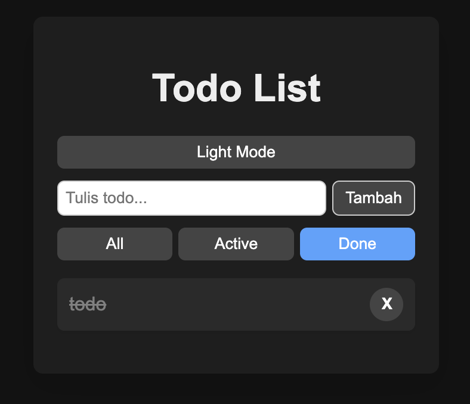

# 📝 Todo List App

A modern and clean Todo List web application built using Vanilla JavaScript.

## 🚀 Features
- Add & delete todo
- Mark todo as done
- Edit todo (double click)
- Filter todo (All / Active / Done)
- Dark Mode (saved automatically)
- Keyboard shortcuts (Enter & Esc)
- Data stored using localStorage

## 🛠 Tech Stack
- HTML5
- CSS3
- JavaScript (Vanilla)
- GitHub Pages

## 🌍 Live Demo
https://cros27.github.io/todo-list/

## 📸 Preview

## 👤 Author
**Muhammad Fharhan**  
Frontend Developer (Junior)  
Computer Science Student
